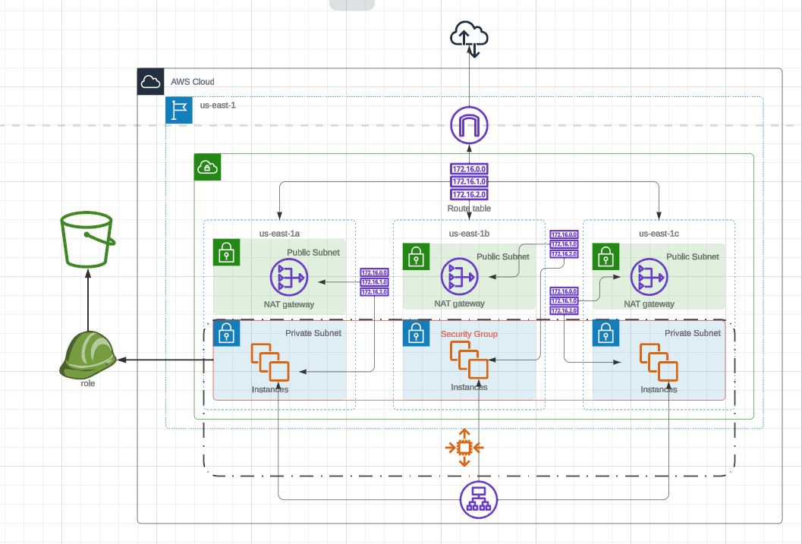

# Udagram Infrastructure as Code Project

## Project Introduction
This project provides hands-on experience in deploying a dummy application to an NGINX server running on an EC2 instance using Infrastructure as Code (IaC). The scenario involves creating an Instagram clone called Udagram and deploying it to the AWS infrastructure.

## Project Scenario
Your task is to provision the required infrastructure and deploy the Udagram application using IaC. The network infrastructure and the application stack are created as independent CloudFormation stacks for better manageability. Automation is essential for spinning up and tearing down environments on demand.
## Infrastructure Diagram

<br>

## Project Requirements
### Infrastructure Diagram
Create an infrastructure diagram to visualize the solution. Include the following AWS resources:
- Network resources: VPC, subnets, Internet Gateway, NAT Gateways
- EC2 resources: Autoscaling group with EC2 instances, Load Balancer, Security Groups
- Static Content: S3 bucket

### Network and Servers Configuration
- Deploy to any AWS region
- Create a new VPC with four subnets (two public, two private) following high availability best practices
- Use a parameters JSON file to pass CIDR blocks for VPC and subnets
- Attach Internet and NAT gateways for internet access
- Utilize Launch Templates for Autoscaling Group with t2.micro instances running Ubuntu 22
- Expose the application to the internet using an Application Load Balancer

### Static Content
- Create an S3 bucket with CloudFormation for storing static content
- Configure the bucket for public-read access
- Assign IAM Role to servers with read and write permissions to the S3 bucket

### Security Groups
- Allow inbound traffic on HTTP Port 80 for servers, Load Balancer, and Health Check
- Allow unrestricted outbound internet access for servers
- Configure Load Balancer to allow all public traffic (0.0.0.0/0) on port 80

### CloudFormation Templates
- Deliver two separate templates: one for networking resources and one for application-specific resources
- Use outputs from the networking template in the application template
- Include an output for the public URL of the Load Balancer

## Project Deployment
1. **Diagram:** Create an infrastructure diagram using the tool of your choice.
2. **CloudFormation Templates:** Provide network.yml, network-parameters.json, udagram.yml, and udagram-parameters.json files.
3. **Scripts:** Include create.sh, update.sh, and delete.sh for automated infrastructure management.
4. **Readme:** Include this README.md file with creation and deletion instructions and additional useful information.

## Deployment Instructions
To deploy the Udagram infrastructure, run the following command:

```bash
./create.sh Udagram udagram.yml udagram-parameter.json
./create.sh Udagram network.yml network-parameter.json
```
## Destroy Instructions
To destroy the Udagram infrastructure, run the following command:

```bash
./delete.sh Udagram
```


Use the provided scripts for creating, updating, and deleting the CloudFormation stack. Ensure all dependencies are met before executing the scripts.

